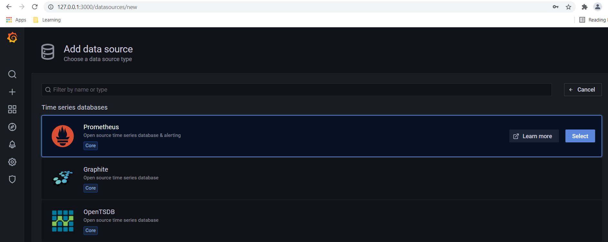
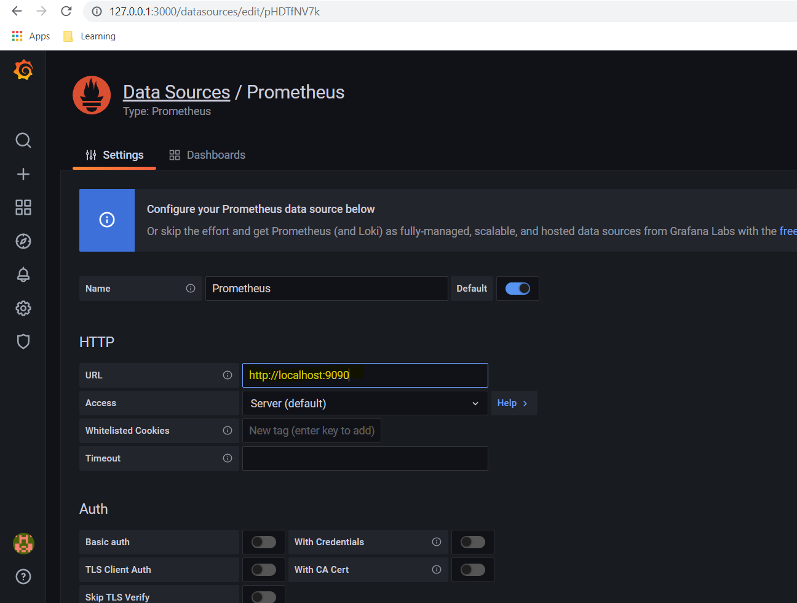
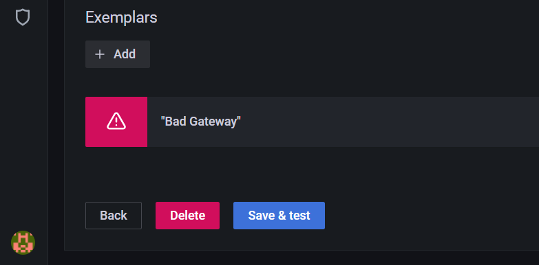
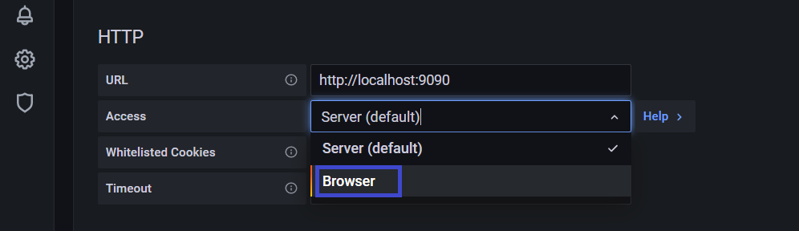
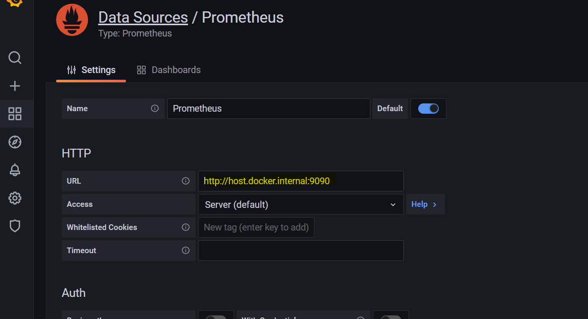
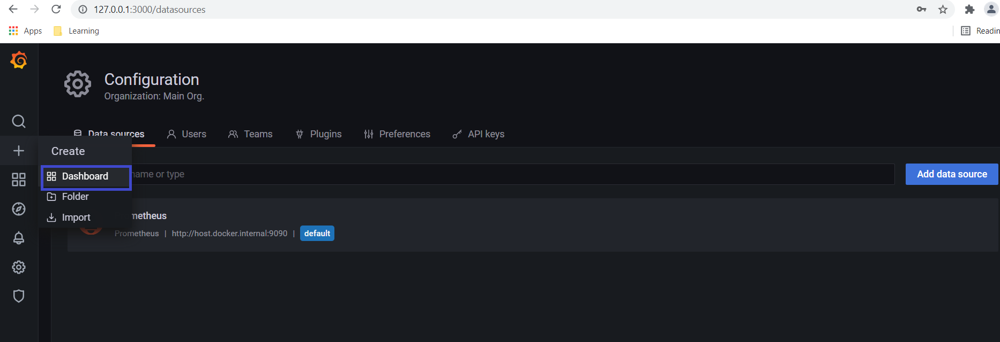
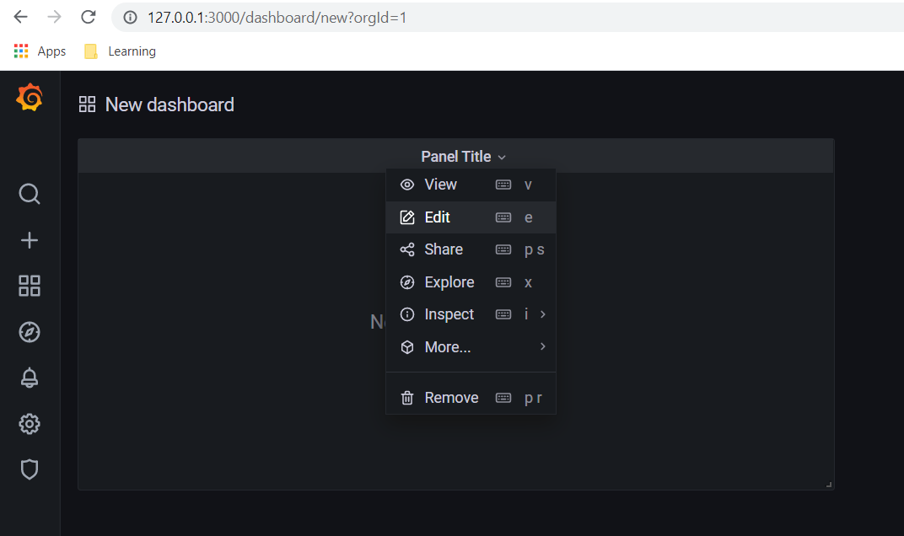
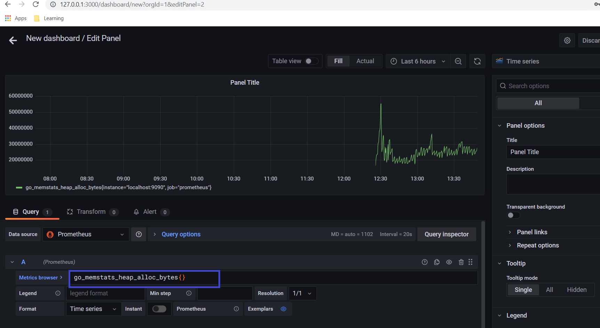
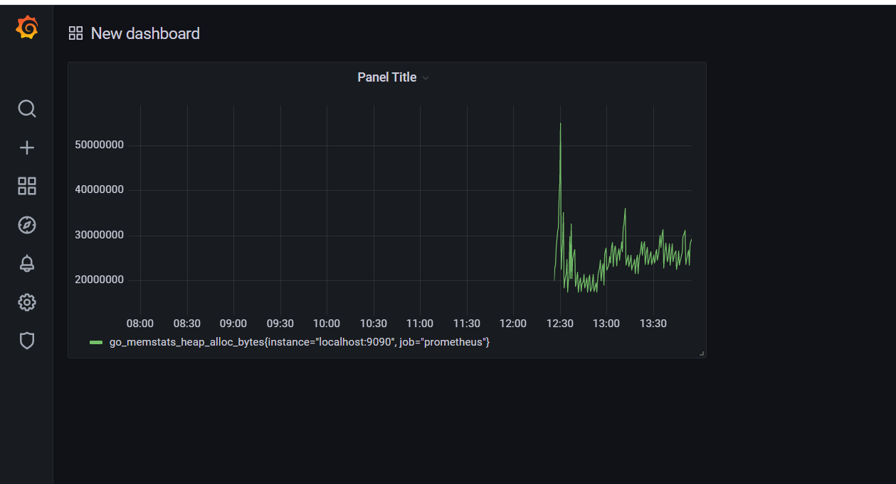
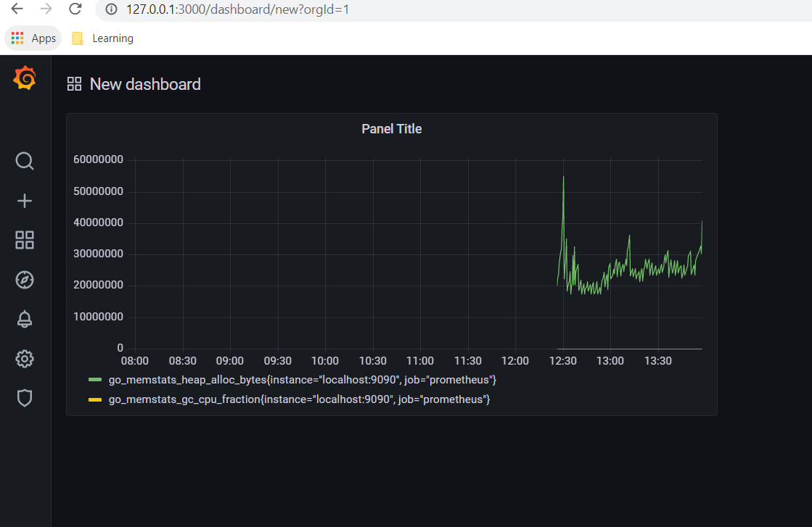

# Project Description
This project is integration of springboot application with prometheus

# Getting Started

**Step 1)** Add actuator and micrometer dependencies in project pom.xml file

       <dependency>
			<groupId>org.springframework.boot</groupId>
			<artifactId>spring-boot-starter-actuator</artifactId>
		</dependency>
		
		<dependency>
			<groupId>io.micrometer</groupId>
			<artifactId>micrometer-registry-prometheus</artifactId>
		</dependency>
		
**Step 2)** Enable metrics by adding below properties in application properties/yml file

	management.endpoints.web.exposure.include=*
	management.endpoint.health.show-details=always
	
**Step 3)** Run Spring boot application, Browse to URL [http://127.0.0.1:8080/actuator](http://127.0.0.1:8080/actuator) and check for prometheus actuator endpoint along with other endpoints

**Step 4)** Browse to [http://127.0.0.1:8080/actuator/prometheus](http://127.0.0.1:8080/actuator/prometheus) and check metrics exported from spring boot application 

**Step 4)** Create a prometheus config file ***prometheus.yml*** file for prometheus to get metrics from spring boot application. 

**Step 5)** Specify config file location to prometheus while starting it. (Optional You can also run prometheus in docker)

    docker run -p 9090:9090 -v D:\monitoring-solutions\springboot-prometheus-example\src\main\resources\prometheus.yml prom/prometheus
    
Browse to URL: [http://127.0.0.1:9090](http://127.0.0.1:9090)

**Step 6)** List of metrics can be viewed as dropdown in prometheus old ui 

or 
 
browse [http://localhost:9090/metrics](http://localhost:9090/metrics)

**Step 7)** Select any metrics and click Execute

**Step 8)** To view metrics in Grafana, Run grafana image 

    docker run -d --name=grafana -p 3000:3000 grafana/grafana
    
Browse to URL [http://127.0.0.1:3000](http://127.0.0.1:3000)

**Step 9)** Login to Grafana (default username and password is admin/admin)

**Step 10)** Goto Settings -> Data Sources to add datasources for Grafana

**Step 11)** Select Prometheus Data Source for Grafana

**Step 12)** Provide Prometheus URL at input URL and Access -> Server and then click on ***Save and Test*** button

You might get Error: Bad Gateway

This is because localhost is not allowed in Grafana URL. To solve this, either Change Access to Browser

OR

(preferrable) provide prometheus domain name. As currently prometheus is running on docker, so mention [http://host.docker.internal:9090](http://host.docker.internal:9090) in URL

Either way, it should solve datasource problem

**Step 13)** Now Goto "Dashboard" to create a view and select "Empty Panel"

Edit the panel

**Step 14)** Specify one of prometheus metric in Grafana followed by {} and press "Shift + Enter" or Click on Metrics Browser, Select a metric and Click "Use Query"

You may add multiple Queries

**Step 15)** You can view the same in your dashboard

### Reference Documentation
For further reference, please consider the following sections:

* [Official Apache Maven documentation](https://maven.apache.org/guides/index.html)
* [Spring Boot Maven Plugin Reference Guide](https://docs.spring.io/spring-boot/docs/2.5.4/maven-plugin/reference/html/)
* [Create an OCI image](https://docs.spring.io/spring-boot/docs/2.5.4/maven-plugin/reference/html/#build-image)
* [Spring Web](https://docs.spring.io/spring-boot/docs/2.5.4/reference/htmlsingle/#boot-features-developing-web-applications)
* [Spring Boot Actuator](https://docs.spring.io/spring-boot/docs/2.5.4/reference/htmlsingle/#production-ready)
* [Prometheus](https://docs.spring.io/spring-boot/docs/2.5.4/reference/html/production-ready-features.html#production-ready-metrics-export-prometheus)
* [DZone - Springboot montoring](https://dzone.com/articles/monitoring-using-spring-boot-2-prometheus-and-graf)
* [Grafana Bad Gateway Error](https://github.com/grafana/grafana/issues/14629)

### Guides
The following guides illustrate how to use some features concretely:

* [Building a RESTful Web Service](https://spring.io/guides/gs/rest-service/)
* [Serving Web Content with Spring MVC](https://spring.io/guides/gs/serving-web-content/)
* [Building REST services with Spring](https://spring.io/guides/tutorials/bookmarks/)
* [Building a RESTful Web Service with Spring Boot Actuator](https://spring.io/guides/gs/actuator-service/)

